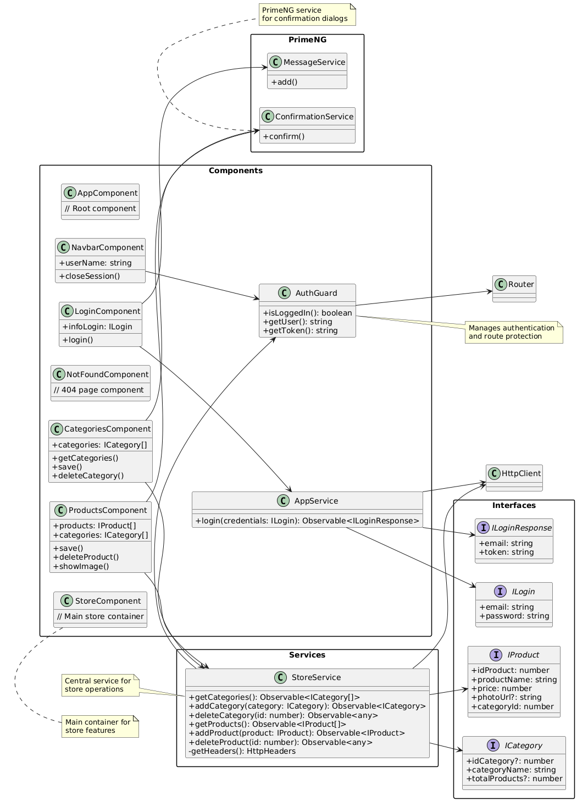
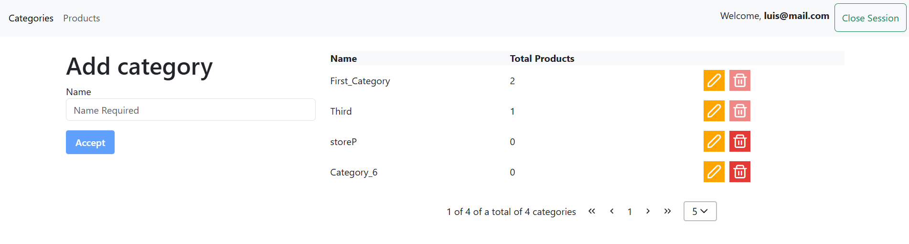
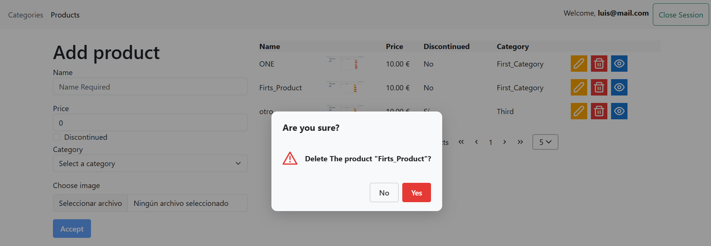

## AngularStore_20

**AngularStore_20** is a web application that provides a user interface for managing categories and products. The application requires users to log in to access its features (Category Management and Product Management). This project was generated with [Angular CLI](https://github.com/angular/angular-cli) version 20.1.2.



AngularStore_20/  
├───app/  
│   ├───guards/  
│   │   └───AuthGuardService.ts  
│   ├───interfaces/  
│   │   └───LoginInterface.ts  
│   ├───services/  
│   │   └───AppService.ts  
│   ├───shared/  
│   │   ├───navbar/  
│   │   │   ├───NavbarComponent.html  
│   │   │   └───NavbarComponent.ts  
│   │   └───shared.module.ts  
│   ├───start/  
│   │   ├───login/  
│   │   │   ├───LoginComponent.css  
│   │   │   ├───LoginComponent.html  
│   │   │   └───LoginComponent.ts  
│   │   ├───not-found/  
│   │   │   ├───NotFoundComponent.css  
│   │   │   ├───NotFoundComponent.html  
│   │   │   └───NotFoundComponent.ts  
│   │   └───start.module.ts  
│   ├───store/  
│   │   ├───categories/  
│   │   │   ├───CategoriesComponent.css  
│   │   │   ├───CategoriesComponent.html  
│   │   │   └───CategoriesComponent.ts  
│   │   ├───products/  
│   │   │   ├───ProductsComponent.css  
│   │   │   ├───ProductsComponent.html  
│   │   │   └───ProductsComponent.ts  
│   │   ├───StoreComponent.html  
│   │   ├───StoreComponent.ts  
│   │   ├───StoreInterfaces.ts  
│   │   ├───StoreService.ts  
│   ├───AppComponent.html  
│   └───AppComponent.ts  
├───environments/  
│   ├───EnvironmentDevelopment.ts  
│   └───Environment.ts  
├───angular.json  
└───package.json  






## environment

```
export const environment = {urlAPI: 'https://localhost:7177/api/'};
```

[DeepWiki moraisLuismNet/AngularStore_20](https://deepwiki.com/moraisLuismNet/AngularStore_20)

## Development server

Run `ng serve` for a dev server. Navigate to `http://localhost:4200/`. The application will automatically reload if you change any of the source files.

## Code scaffolding

Run `ng generate component component-name` to generate a new component. You can also use `ng generate directive|pipe|service|class|guard|interface|enum|module`.

## Build

Run `ng build` to build the project. The build artifacts will be stored in the `dist/` directory.

## Running unit tests

Run `ng test` to execute the unit tests via [Karma](https://karma-runner.github.io).

## Running end-to-end tests

Run `ng e2e` to execute the end-to-end tests via a platform of your choice. To use this command, you need to first add a package that implements end-to-end testing capabilities.

## Further help

To get more help on the Angular CLI use `ng help` or go check out the [Angular CLI Overview and Command Reference](https://angular.io/cli) page.

